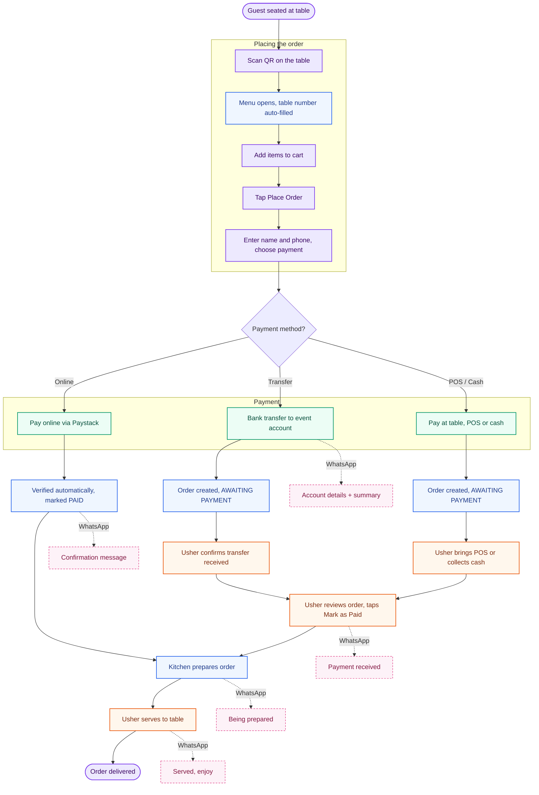
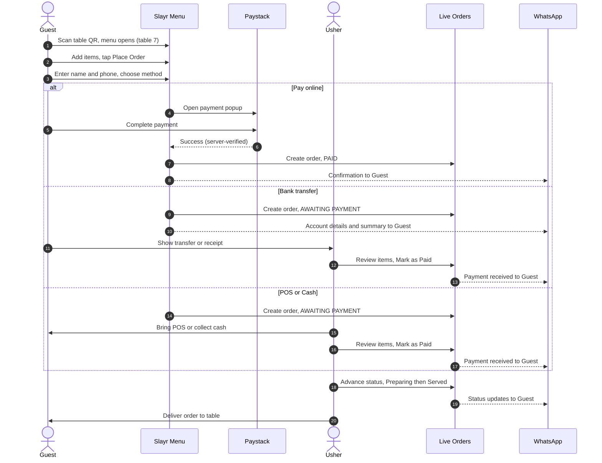
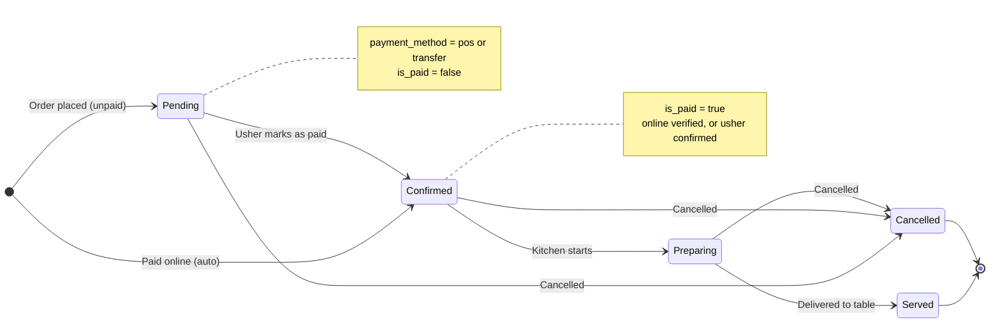
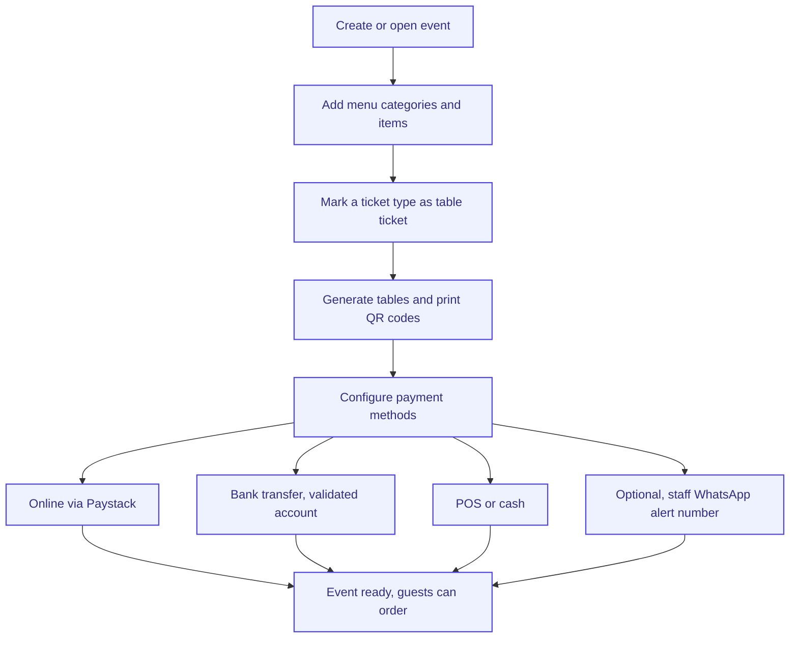

# Slayr — Table Ordering & Usher Flow

Diagrams are written in [Mermaid](https://mermaid.live). To preview, copy the code
**inside** a ```mermaid block (not the fences) into the live editor.

1. End-to-end journey
2. Sequence diagram (systems + people, with WhatsApp touchpoints)
3. Order status lifecycle
4. Admin setup (one-time per event)

---

## 1 · End-to-end journey



---

## 2 · Sequence — systems & people



---

## 3 · Order status lifecycle



---

## 4 · Admin setup (one-time per event)



---

### One-line brief for an usher

> Orders appear on the **Live Orders** screen in real time. If an order is already
> **Paid** (online), just prepare and serve it. If it says **Awaiting payment**, collect
> it at the table — POS, cash, or confirm the transfer — then review the items and tap
> **Mark as Paid**. Move each order through **Preparing → Served**. The guest is kept in
> the loop automatically over WhatsApp at every step.
```
